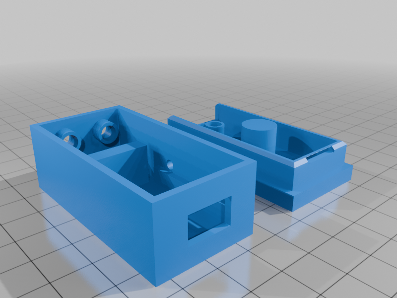
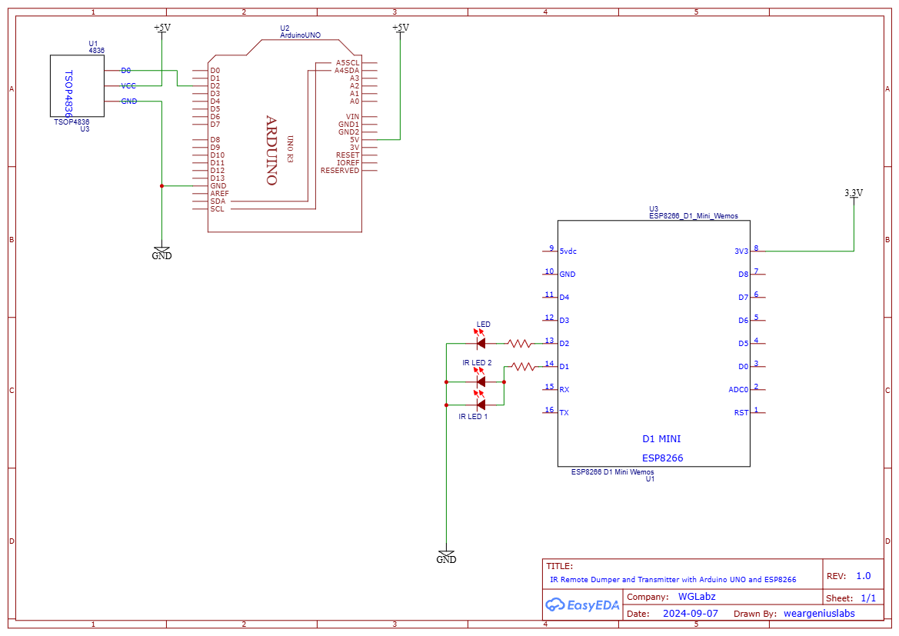

## YouTube Videos
<div style="display: flex; justify-content: space-between;">
  <a href="https://www.youtube.com/watch?v=LLLSsqom8IQ" target="_blank">
    
  </a>
  <a href="https://www.youtube.com/watch?v=VSztTkb7J70" target="_blank" style="margin-right: 10px;">
    
  </a>
</div>

## Project Enclosure:



[Thingiverse Link](https://www.thingiverse.com/thing:6781125)

## Connection Diagram:



## TASMOTA set up

```js
Rule1 ON IrSend#Data DO Led1 ON ENDON ON IrSend#Data DO backlog delay 5; Led1 OFF ENDON
Rule1 1

on/off: irsend 0,8930,4420,580,570,580,520,580,570,580,520,580,570,580,520,580,570,580,520,580,1670,580,1620,580,570,580,520,580,1670,580,1620,580,1670,580,1670,580,1620,580,570,580,520,580,570,580,1620,580,570,580,520,580,1670,580,520,580,1670,580,1670,580,1620,580,570,580,1620,580,1670,580,520,580
1:      irsend 0,8880,4420,580,570,580,520,580,570,530,570,580,570,530,570,580,520,580,570,580,1670,530,1670,580,570,580,520,580,1620,630,1620,580,1670,580,1670,530,1670,580,1620,630,520,580,1620,630,520,580,570,580,520,580,1620,630,520,580,570,580,1620,580,570,580,1620,580,1670,580,1620,630,520,580
2:      irsend 0,8930,4420,580,520,580,570,580,520,630,520,580,520,580,520,630,520,580,570,580,1620,580,1670,580,520,580,570,580,1620,580,1670,580,1670,580,1620,630,520,580,520,580,570,580,520,580,1670,580,520,630,520,580,1620,580,1670,580,1670,580,1620,580,1670,580,520,580,1670,580,1670,580,520,580
3:      irsend 0,8930,4420,580,570,580,520,580,570,580,520,580,570,580,520,630,520,580,520,580,1670,580,1620,630,520,580,520,580,1670,580,1620,580,1670,580,1670,580,520,580,1670,580,520,580,1670,580,520,580,570,580,520,580,1670,580,1670,530,570,580,1620,630,520,580,1670,580,1620,580,1670,580,520,580
4:      irsend 0,8930,4370,630,520,580,520,630,520,580,570,580,520,580,570,580,520,580,520,630,1620,580,1670,580,520,580,520,630,1620,630,1620,580,1670,580,1620,580,1670,580,1620,630,520,580,570,580,1620,580,570,580,520,580,1670,580,520,580,570,580,1620,580,1670,580,520,580,1670,580,1620,630,520,580
5:      irsend 0,8930,4420,580,520,580,570,580,520,580,570,580,520,580,570,580,520,580,520,630,1620,580,1670,580,520,630,470,630,1620,580,1670,580,1670,580,1620,630,470,630,520,580,520,630,1620,580,520,630,520,580,520,630,1620,580,1670,580,1670,580,1620,580,520,630,1620,580,1670,580,1670,580,520,580
B:      irsend 0,8930,4420,580,570,580,520,580,520,580,570,580,520,580,570,580,520,580,570,580,1620,580,1670,580,570,580,520,580,1670,580,1620,580,1670,580,1620,580,1670,580,1670,580,1620,580,1670,580,520,580,570,580,520,580,1670,580,520,580,570,580,520,580,570,580,1670,580,1620,580,1670,580,520,580
Timer:  irsend 0,8880,4420,630,520,580,520,580,570,580,520,580,570,580,520,580,570,580,520,580,1670,580,1670,580,520,580,520,630,1620,580,1670,580,1620,580,1670,580,520,580,1670,580,1620,630,520,580,1670,580,520,580,520,630,1620,580,1670,580,520,580,520,630,1620,580,570,580,1620,630,1620,580,520,630
OSC:    irsend 0,8930,4420,580,570,580,520,580,570,580,520,580,570,580,520,580,520,630,520,580,1670,580,1670,530,570,580,520,580,1670,580,1670,580,1620,580,1670,580,1670,580,1620,580,1670,580,520,580,1670,580,520,580,570,580,1620,580,570,580,520,580,570,580,1620,580,570,580,1670,530,1670,580,570,580
Sleep:  irsend 0,8930,4370,630,520,580,520,630,520,630,520,580,520,580,570,580,520,580,520,630,1620,630,1620,580,520,630,470,630,1620,630,1620,630,1620,580,1620,630,520,580,1620,580,1670,580,1620,630,520,580,570,580,520,580,1670,580,1620,630,520,580,520,580,570,580,1620,630,1620,580,1620,630,520,580
```
## How to get the IR data from remote control 
* I have used a TSOP IR receiver sensor to copy the data from the remote of the fan, using an Arduino UNO. For the purpose I have used the [Arduino IR Remote](https://github.com/Arduino-IRremote/Arduino-IRremote) library. The usage is fairly simple.

* I used the [ReceiveDump](https://github.com/Arduino-IRremote/Arduino-IRremote/blob/master/examples/ReceiveDump/ReceiveDump.ino) example sketch to dump the data received by TSOP to terminal. Make sure you are using `115200` baud rate and TSOP is connected to `+5V`. 

> Please ensure the TSOP data pin is connected to pin `2` of Arduino UNO.

* Then you can press the button on the remote and you will see the respective data for the button pressed in Arduino console.

A sample data for a button press.

```js
Protocol=NEC Address=0xF300 Command=0x90 Raw-Data=0x6F90F300 32 bits LSB first

Send with: IrSender.sendNEC(0xF300, 0x90, <numberOfRepeats>);

Raw result in internal ticks (50 us) - with leading gap
rawData[68]: 
 -4786
 +179,-88
 +12,-11 +12,-10 +12,-11 +11,-11
 +12,-10 +12,-11 +12,-10 +12,-11
 +12,-32 +12,-33 +12,-11 +12,-10
 +12,-32 +13,-32 +12,-32 +13,-32
 +12,-11 +12,-11 +11,-11 +12,-10
 +12,-33 +12,-11 +11,-11 +12,-32
 +13,-32 +12,-32 +13,-32 +13,-32
 +12,-11 +11,-33 +12,-32 +13,-10
 +12
Sum: 1308  . 
rawData[68]: 
 -239300
 +8950,-4400
 + 600,- 550 + 600,- 500 + 600,- 550 + 550,- 550
 + 600,- 500 + 600,- 550 + 600,- 500 + 600,- 550
 + 600,-1600 + 600,-1650 + 600,- 550 + 600,- 500
 + 600,-1600 + 650,-1600 + 600,-1600 + 650,-1600
 + 600,- 550 + 600,- 550 + 550,- 550 + 600,- 500
 + 600,-1650 + 600,- 550 + 550,- 550 + 600,-1600
 + 600,- 550 + 600,- 550 + 550,- 550 + 600,- 500
 + 600,- 550 + 550,-1650 + 600,-1600 + 650,- 500
 + 600
Sum: 65400

Result as internal 8bit ticks (50 us) array - compensated with MARK_EXCESS_MICROS=20
uint8_t rawTicks[67] = {179,88, 12,11, 12,10, 12,11, 11,11, 12,10, 12,11, 12,10, 12,11, 12,32, 12,33, 12,11, 12,10, 12,32, 13,32, 12,32, 13,32, 12,11, 12,11, 11,11, 12,10, 12,33, 12,11, 11,11, 12,32, 13,32, 12,32, 13,32, 13,32, 12,11, 11,33, 12,32, 13,10, 12};  // Protocol=NEC Address=0xF300 Command=0x90 Raw-Data=0x6F90F300 32 bits LSB first

Result as microseconds array - compensated with MARK_EXCESS_MICROS=20
uint16_t rawData[67] = {8930,4420, 580,570, 580,520, 580,570, 530,570, 580,520, 580,570, 580,520, 580,570, 580,1620, 580,1670, 580,570, 580,520, 580,1620, 630,1620, 580,1620, 630,1620, 580,570, 580,570, 530,570, 580,520, 580,1670, 580,570, 530,570, 580,1620, 630,1620, 580,1620, 630,1620, 630,1620, 580,570, 530,1670, 580,1620, 630,520, 580};  // Protocol=NEC Address=0xF300 Command=0x90 Raw-Data=0x6F90F300 32 bits LSB first

uint16_t address = 0xF300;
uint16_t command = 0x90;
uint32_t rawData = 0x6F90F300;


Pronto Hex as string
char prontoData[] = "0000 006D 0022 0000 0159 00A8 0018 0014 0018 0012 0018 0014 0016 0014 0018 0012 0018 0014 0018 0012 0018 0014 0018 003D 0018 003F 0018 0014 0018 0012 0018 003D 001A 003D 0018 003D 001A 003D 0018 0014 0018 0014 0016 0014 0018 0012 0018 003F 0018 0014 0016 0014 0018 003D 001A 003D 0018 003D 001A 003D 001A 003D 0018 0014 0016 003F 0018 003D 001A 0012 0018 06C3 ";

```


## Atomberg BLDC Fan Raw Data:

> Below are the `rawData` codes for the buttons in the Atomberg fan, that I have. These codes can then be used with TASMOTA and OpenHAB, to control the fan.

* On/Off Button : 

```js
 uint16_t rawData[67] = {8930,4420, 580,570, 580,520, 580,570, 580,520, 580,570, 580,520, 580,570, 580,520, 580,1670, 580,1620, 580,570, 580,520, 580,1670, 580,1620, 580,1670, 580,1670, 580,1620, 580,570, 580,520, 580,570, 580,1620, 580,570, 580,520, 580,1670, 580,520, 580,1670, 580,1670, 580,1620, 580,570, 580,1620, 580,1670, 580,520, 580};  // Protocol=NEC Address=0xF300 Command=0x91 Raw-Data=0x6E91F300 32 bits LSB first
 ```   

* Button 1 :

```js
 uint16_t rawData[67] = {8880,4420, 580,570, 580,520, 580,570, 530,570, 580,570, 530,570, 580,520, 580,570, 580,1670, 530,1670, 580,570, 580,520, 580,1620, 630,1620, 580,1670, 580,1670, 530,1670, 580,1620, 630,520, 580,1620, 630,520, 580,570, 580,520, 580,1620, 630,520, 580,570, 580,1620, 580,570, 580,1620, 580,1670, 580,1620, 630,520, 580};  // Protocol=NEC Address=0xF300 Command=0x8B Raw-Data=0x748BF300 32 bits LSB first
```   

* Button 2 : 

```js
uint16_t rawData[67] = {8930,4420, 580,520, 580,570, 580,520, 630,520, 580,520, 580,520, 630,520, 580,570, 580,1620, 580,1670, 580,520, 580,570, 580,1620, 580,1670, 580,1670, 580,1620, 630,520, 580,520, 580,570, 580,520, 580,1670, 580,520, 630,520, 580,1620, 580,1670, 580,1670, 580,1620, 580,1670, 580,520, 580,1670, 580,1670, 580,520, 580};  // Protocol=NEC Address=0xF300 Command=0x90 Raw-Data=0x6F90F300 32 bits LSB first
```   

* Button 3 : 
```js 
uint16_t rawData[67] = {8930,4420, 580,570, 580,520, 580,570, 580,520, 580,570, 580,520, 630,520, 580,520, 580,1670, 580,1620, 630,520, 580,520, 580,1670, 580,1620, 580,1670, 580,1670, 580,520, 580,1670, 580,520, 580,1670, 580,520, 580,570, 580,520, 580,1670, 580,1670, 530,570, 580,1620, 630,520, 580,1670, 580,1620, 580,1670, 580,520, 580};  // Protocol=NEC Address=0xF300 Command=0x8A Raw-Data=0x758AF300 32 bits LSB first
```   

* Button 4 : 
```js 
uint16_t rawData[67] = {8930,4370, 630,520, 580,520, 630,520, 580,570, 580,520, 580,570, 580,520, 580,520, 630,1620, 580,1670, 580,520, 580,520, 630,1620, 630,1620, 580,1670, 580,1620, 580,1670, 580,1620, 630,520, 580,570, 580,1620, 580,570, 580,520, 580,1670, 580,520, 580,570, 580,1620, 580,1670, 580,520, 580,1670, 580,1620, 630,520, 580};  // Protocol=NEC Address=0xF300 Command=0x93 Raw-Data=0x6C93F300 32 bits LSB first
```   

* Button 5 : 
```js 
uint16_t rawData[67] = {8930,4420, 580,520, 580,570, 580,520, 580,570, 580,520, 580,570, 580,520, 580,520, 630,1620, 580,1670, 580,520, 630,470, 630,1620, 580,1670, 580,1670, 580,1620, 630,470, 630,520, 580,520, 630,1620, 580,520, 630,520, 580,520, 630,1620, 580,1670, 580,1670, 580,1620, 580,520, 630,1620, 580,1670, 580,1670, 580,520, 580};  // Protocol=NEC Address=0xF300 Command=0x88 Raw-Data=0x7788F300 32 bits LSB first
```   

* Button B : 
```js 
uint16_t rawData[67] = {8930,4420, 580,570, 580,520, 580,520, 580,570, 580,520, 580,570, 580,520, 580,570, 580,1620, 580,1670, 580,570, 580,520, 580,1670, 580,1620, 580,1670, 580,1620, 580,1670, 580,1670, 580,1620, 580,1670, 580,520, 580,570, 580,520, 580,1670, 580,520, 580,570, 580,520, 580,570, 580,1670, 580,1620, 580,1670, 580,520, 580};  // Protocol=NEC Address=0xF300 Command=0x8F Raw-Data=0x708FF300 32 bits LSB first
```   

* Button Timer : 
```js 
uint16_t rawData[67] = {8880,4420, 630,520, 580,520, 580,570, 580,520, 580,570, 580,520, 580,570, 580,520, 580,1670, 580,1670, 580,520, 580,520, 630,1620, 580,1670, 580,1620, 580,1670, 580,520, 580,1670, 580,1620, 630,520, 580,1670, 580,520, 580,520, 630,1620, 580,1670, 580,520, 580,520, 630,1620, 580,570, 580,1620, 630,1620, 580,520, 630};  // Protocol=NEC Address=0xF300 Command=0x96 Raw-Data=0x6996F300 32 bits LSB first
```   

* Button OSC : 
```js 
uint16_t rawData[67] = {8930,4420, 580,570, 580,520, 580,570, 580,520, 580,570, 580,520, 580,520, 630,520, 580,1670, 580,1670, 530,570, 580,520, 580,1670, 580,1670, 580,1620, 580,1670, 580,1670, 580,1620, 580,1670, 580,520, 580,1670, 580,520, 580,570, 580,1620, 580,570, 580,520, 580,570, 580,1620, 580,570, 580,1670, 530,1670, 580,570, 580};  // Protocol=NEC Address=0xF300 Command=0x97 Raw-Data=0x6897F300 32 bits LSB first
```   

* Button SLEEP : 
```js 
uint16_t rawData[67] = {8930,4370, 630,520, 580,520, 630,520, 630,520, 580,520, 580,570, 580,520, 580,520, 630,1620, 630,1620, 580,520, 630,470, 630,1620, 630,1620, 630,1620, 580,1620, 630,520, 580,1620, 580,1670, 580,1620, 630,520, 580,570, 580,520, 580,1670, 580,1620, 630,520, 580,520, 580,570, 580,1620, 630,1620, 580,1620, 630,520, 580};  // Protocol=NEC Address=0xF300 Command=0x8E Raw-Data=0x718EF300 32 bits LSB first
```

## OpenHAB Setup
In openHAB create a Thing, and add a channel. The channel can be named `IRSend`. The configuration of the channel would have the MQTT topic `cmnd/tasmota_994B6D/irsend`

Create 3 iTems, of types, String, and 2 Switches for On/Off and Osc.

After that create teh 3 transformations below,

### JS Transformations

> On/Off controle
```js
(function() {
  return "0,8930,4420,580,570,580,520,580,570,580,520,580,570,580,520,580,570,580,520,580,1670,580,1620,580,570,580,520,580,1670,580,1620,580,1670,580,1670,580,1620,580,570,580,520,580,570,580,1620,580,570,580,520,580,1670,580,520,580,1670,580,1670,580,1620,580,570,580,1620,580,1670,580,520,580";
})(input)
```

> OSC Control
```js
(function() {
   return "0,8930,4420,580,570,580,520,580,570,580,520,580,570,580,520,580,520,630,520,580,1670,580,1670,530,570,580,520,580,1670,580,1670,580,1620,580,1670,580,1670,580,1620,580,1670,580,520,580,1670,580,520,580,570,580,1620,580,570,580,520,580,570,580,1620,580,570,580,1670,530,1670,580,570,580";
})(input)
```

> Speed control

```javascript
(function(data) {
  var returnVal;
  switch(data){
    case "0": //On OFF
      returnVal="0,8930,4420,580,570,580,520,580,570,580,520,580,570,580,520,580,570,580,520,580,1670,580,1620,580,570,580,520,580,1670,580,1620,580,1670,580,1670,580,1620,580,570,580,520,580,570,580,1620,580,570,580,520,580,1670,580,520,580,1670,580,1670,580,1620,580,570,580,1620,580,1670,580,520,580";
      break;
    case "1":
      returnVal="0,8880,4420,580,570,580,520,580,570,530,570,580,570,530,570,580,520,580,570,580,1670,530,1670,580,570,580,520,580,1620,630,1620,580,1670,580,1670,530,1670,580,1620,630,520,580,1620,630,520,580,570,580,520,580,1620,630,520,580,570,580,1620,580,570,580,1620,580,1670,580,1620,630,520,580";
      break;
    case "2":
      returnVal="0,8930,4420,580,520,580,570,580,520,630,520,580,520,580,520,630,520,580,570,580,1620,580,1670,580,520,580,570,580,1620,580,1670,580,1670,580,1620,630,520,580,520,580,570,580,520,580,1670,580,520,630,520,580,1620,580,1670,580,1670,580,1620,580,1670,580,520,580,1670,580,1670,580,520,580";
      break;
    case "3":
      returnVal="0,8930,4420,580,570,580,520,580,570,580,520,580,570,580,520,630,520,580,520,580,1670,580,1620,630,520,580,520,580,1670,580,1620,580,1670,580,1670,580,520,580,1670,580,520,580,1670,580,520,580,570,580,520,580,1670,580,1670,530,570,580,1620,630,520,580,1670,580,1620,580,1670,580,520,580";
      break;
    case "4":
      returnVal="0,8930,4370,630,520,580,520,630,520,580,570,580,520,580,570,580,520,580,520,630,1620,580,1670,580,520,580,520,630,1620,630,1620,580,1670,580,1620,580,1670,580,1620,630,520,580,570,580,1620,580,570,580,520,580,1670,580,520,580,570,580,1620,580,1670,580,520,580,1670,580,1620,630,520,580";
      break;
    case "5":
      returnVal="0,8930,4420,580,520,580,570,580,520,580,570,580,520,580,570,580,520,580,520,630,1620,580,1670,580,520,630,470,630,1620,580,1670,580,1670,580,1620,630,470,630,520,580,520,630,1620,580,520,630,520,580,520,630,1620,580,1670,580,1670,580,1620,580,520,630,1620,580,1670,580,1670,580,520,580";
      break;
    case "6":
      returnVal="0,8930,4420,580,570,580,520,580,520,580,570,580,520,580,570,580,520,580,570,580,1620,580,1670,580,570,580,520,580,1670,580,1620,580,1670,580,1620,580,1670,580,1670,580,1620,580,1670,580,520,580,570,580,520,580,1670,580,520,580,570,580,520,580,570,580,1670,580,1620,580,1670,580,520,580";
      break;
    default:
      returnVal="NO VAL";
      break;
  }
  return returnVal;
})(input)
```

### OpenHAB Sitemap

```xml
sitemap home label="Home" {
    Frame icon=fan_ceiling label="Fan Control" {
        Setpoint icon=fan_box item=Fan_Remote_IR_IRSend2 label="Speed" maxValue=6 minValue=1 step=1
        Switch item=Fan_Remote_OSC label="Oscillation" mappings=["OFF"="TOGGLE"]
        Switch item=Fan_Remote_OnOff mappings=["OFF"="TOGGLE"]
    }
}

```
